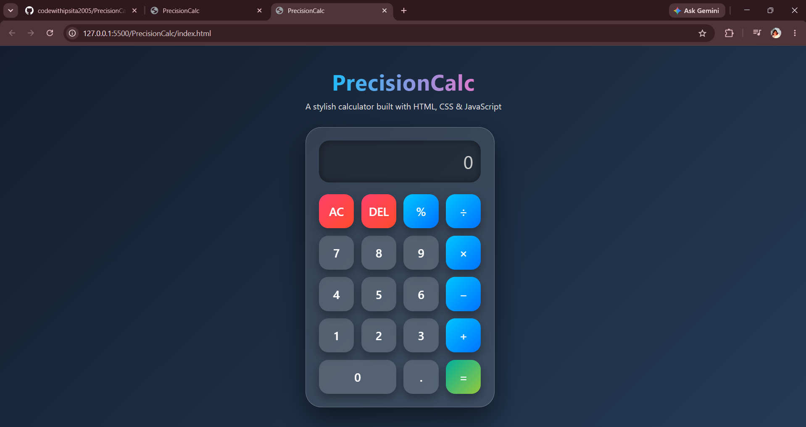

# 🚀 PrecisionCalc

<div align="center">

### 🧮 A Modern & Responsive Calculator Built with HTML, CSS & JavaScript

✨ Fast • Accurate • Responsive • User-Friendly ✨

</div>

---

## 🌐 Live Demo

🚀 Experience PrecisionCalc online:

🔗 https://codewithipsita2005.github.io/PrecisionCalc/


---

## 📸 Project Preview

<p align="center">
  
</p>

---

## 📖 About The Project

PrecisionCalc is a sleek and interactive web-based calculator designed to perform everyday arithmetic operations with speed and accuracy. Built using core front-end technologies, this project demonstrates responsive design, JavaScript functionality, and clean user interface development.

Whether you're performing quick calculations or exploring front-end development concepts, PrecisionCalc delivers a smooth and intuitive experience.

---

## 🌟 Features

✅ Addition, Subtraction, Multiplication & Division

✅ Clean & Modern User Interface

✅ Responsive Design for Different Screen Sizes

✅ Clear (C) Function

✅ Delete (⌫) Function

✅ Error Handling

✅ Fast Performance

---

## 🛠️ Tech Stack

| Technology | Usage |
|------------|--------|
| 🌐 HTML5 | Structure |
| 🎨 CSS3 | Styling & Layout |
| ⚡ JavaScript | Functionality & Logic |

---

## 📂 Project Structure

```bash
PrecisionCalc
│
├── assets
│   └── precisioncalc_preview_cropped.png
│
├── index.html
├── style.css
├── script.js
└── README.md
```

---

## 🎯 Learning Outcomes

Through this project, I gained hands-on experience in:

- 🎨 Front-End Development
- 📱 Responsive Web Design
- ⚡ JavaScript DOM Manipulation
- 🧩 Event Handling
- 💡 Problem Solving
- 🚀 Git & GitHub Workflow

---

## 📸 Preview

🖥️ Modern Calculator Interface

📱 Mobile-Friendly Layout

⚡ Real-Time Calculations

---

## 🚀 Future Enhancements

- 🌙 Dark/Light Mode
- ⌨️ Keyboard Support
- 📜 Calculation History
- 📊 Scientific Calculator Functions
- 🎭 Theme Customization

---

## 🤝 Contributing

Contributions, suggestions, and improvements are welcome!

Feel free to:

🍴 Fork the repository

🌟 Star the project

📥 Submit Pull Requests

🐛 Report Issues

---

## 👩‍💻 Developer

### Ipsita Ghosh

🎓 B.Tech CSE Student

💻 Aspiring Full-Stack Developer

🌱 Currently Learning Web Development, DSA & Software Engineering

---

## 🌐 Let's Connect

🔗 LinkedIn: https://www.linkedin.com/in/ipsita-ghosh-11966b307

💻 GitHub: https://github.com/codewithipsita2005

📩 Email: ipsitaghosh2005@gmail.com

🚀 Open to learning, collaboration, internships, and exciting tech opportunities!

---

<div align="center">

### ⭐ If you found this project useful, don't forget to give it a Star! ⭐

🚀 Happy Coding! 🚀

</div>
